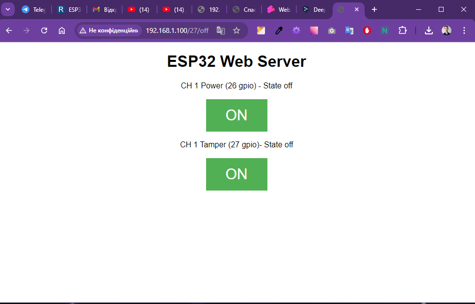

# WebServerRemoteControl

## API example
   ####  http://192.168.1.106/26/on
   ####  http://192.168.1.106/26/off

   ####  http://192.168.1.106/27/on
   ####  http://192.168.1.106/27/off

## Comands Serial Monitor
### 1 Chanel
  ### Запит
    #### request_ch_1_power_on - вкл кнопку power на датчику
    #### request_ch_1_power_off - викл кнопку power на датчику
    #### request_ch_1_tamper_on - вкл кнопку tamper на датчику
    #### request_ch_1_tamper_off - викл кнопку tamper на датчику
  ### Відповідь на запит, якщо запит був успішний
    #### response_ch_1_power_on - вкл кнопку power на датчику
    #### response_ch_1_power_off - викл кнопку power на датчику
    #### response_ch_1_tamper_on - вкл кнопку tamper на датчику
    #### response_ch_1_tamper_off - викл кнопку tamper на датчику

  ### Системні запити
    #### release_version - повертає версію прошивки

## User interface

